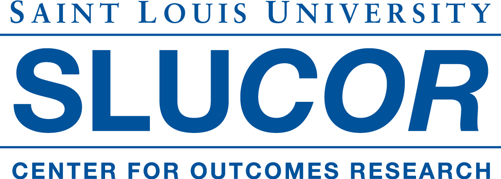

```{r setup, include=FALSE}
options(htmltools.dir.version = FALSE)
```

# What is R-Ladies?

- R-Ladies is a world-wide organization with the mission of promoting **gender diversity in the R community**  

- Started in San Francisco in 2012  

- Currently has **63 chapters and 13,000** members globally  
<center>


---

# R-Ladies St. Louis 

* Started in September 2017 by Jenine Harris and Chelsea West 


---
# R-Ladies St. Louis 2017-2018 Meetups

- Meet & greet with Dr. Bobbi Carothers, Dr. Angelique Zeringue, Alexandra Morshed, Mary Painter, Rebecca Willison, & Lorinette Worth 

- RCPP Introduction with Erin Rossiter 

- Introduction to R with Shelly Cooper 

- Intro Part Deux with Mary Painter & Christina Garcia 


    

---


# R-Ladies St. Louis 2017-2018 sponsors

<center>
&nbsp;&nbsp;&nbsp;&nbsp;  &nbsp;&nbsp;&nbsp;&nbsp;   &nbsp;&nbsp;&nbsp;&nbsp;

  &nbsp;&nbsp;&nbsp;&nbsp;   &nbsp;&nbsp;&nbsp;&nbsp;     &nbsp;&nbsp;&nbsp;&nbsp;     &nbsp;&nbsp;&nbsp;&nbsp;     


---
# Meetups planned for 2018-2019 

- (October 3) Reproducible research with R with Dr. Bobbi Carothers 

- (November 14) Plotting something great: Making Graphs in R with Shelly Cooper 

- (February 9) Git going with GitHub with Laura Gardner 

- (April 11) Mapping St. Louis health and social data with R with Dr. Chris Prener

<center><br>


---

# Tonight 

- Dr. Bobbi Carothers is back to talk about Reproducible Research in R


- Food and space provided by our sponsors, net**effects** and **Sense Corp** 
<center>
&nbsp;&nbsp;&nbsp;&nbsp;

---

# Want to learn more or get involved?

- Visit **rladies.org** to learn about the mission and global work of R-Ladies 

- Connect with R-Ladies St. Louis 
    + Email us at **rladiesstl@gmail.com** 
    + Follow us on Twitter **@rladiesstl**
    + Connect with us on Meetup 
    

---
# Setting up for the workshop

- Install 
    + R
    + R Studio
    + Packages: rmarkdown, knitr, dpylr, labelled, dataMaid, codebook

- Download
    + NHANES data from https://github.com/rladiesstl/meetup-Oct18 
    + NHANES codebook from https://wwwn.cdc.gov/Nchs/Nhanes/2011-2012/AUQ_G.htm 
    + Toolkit from https://github.com/coding2share/ReproducibilityToolkit  (click on Clone or download to download .zip file then extract contents)

